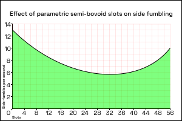
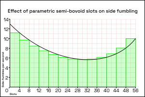
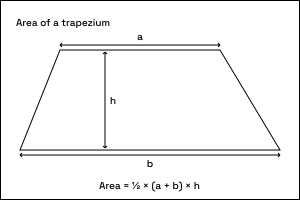
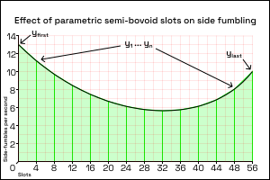

# Trapezium rule
*Higher tier only*

## Ingredients
- How to read a graph
- Basic shapes
- Formation of algebraic expressions
- Substitution

## Foreword
[Skip to method](#method)

Here's a graph:  
  

How can we get the area under the curve? The area under the curve is the area highlighted in green.
Well, we could divide the curve into a series of rectangles:

And we could get an approximate area of the curve by adding up the areas of all the rectangles.
However, you can tell visually that this is a very inaccurate approach. Can we do better?

Well, we could use trapeziums instead.

Recall that the area of a trapezium is ½ × (a + b) × h:

Therefore, we could instead divide the curve into a series of trapeziums:

The long sides of the trapeziums have labels.
Yfirst and Ylast are the first and last lengths of the trapeziums.
Y1 to Yn are the rest of the lengths of the trapeziums.
The height of the trapezium is how wide it is on the graph. In this example, it's four slots wide.

Using the formula for the area of the trapezium, we can construct a formula for the approximate area of the curve:
<pre>
Area under curve = ½(Yfirst + Y1)h + ½(Y1 + Y2)h + ... + ½(Yn + Ylast)h
</pre>

Because every length appears twice, except for the first and last, we can simplify this formula into:
<pre>
Area under curve = ½ × h(Yfirst + Ylast + 2(Y1 + Y2 + ... + Yn))
</pre>

## Method

<pre>
Area under curve = ½ × h(Yfirst + Ylast + 2(Y1 + Y2 + ... + Yn))
</pre>
